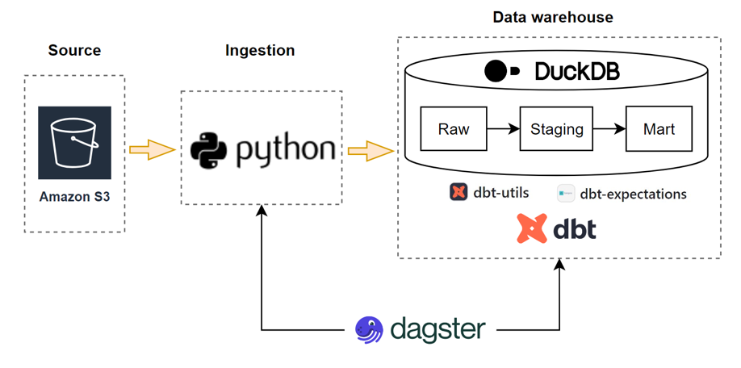
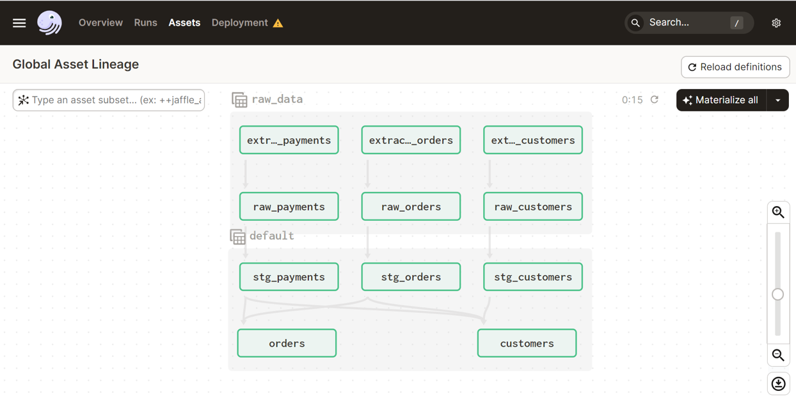

# trusted-data-pipeline

*Data pipelines and architecture*

<center></center>


*Dagster global assets*

<center></center>

### Setup environment

```
python3 -m venv venv
source venv/bin/activate
pip install -r requirements.txt

```

### DBT setup

```
cd ./dbt/jaffle_shop/
dbt deps
dbt build
dbt run
dbt test

dbt docs generate
dbt docs serve --port 8081

dbt show --inline "select count(*) from {{ ref('stg_customers') }}"
```